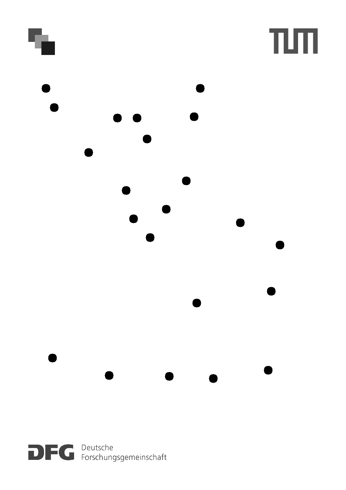

# Drawing game for the Minimum Spanning Tree

A drawing game for the Minimum Spanning Tree (MST) problem.
The game is aimed to get people of all ages to engage with algorithmic thinking.


# Installation

Missing in the repository are the authentication credentials for Google Drive.
To get them, follow the steps below:

1. Create a new project in the [Google Cloud Console](https://console.cloud.google.com/).
2. Enable the Google Drive API.
3. Create a new OAuth client ID.
4. Download the credentials file.
5. Move the credentials file to the project folder as `credentials.json`.
6. Run the script `download_files.py` to download the files from Google Drive.

The script will create a file `token.pickle` in the project folder.

Finally, enter the Google Drive ID of the folder containing the files in the `main.py` file.

# Usage

To run the application, execute the following command:

```
python main.py
```

The Flask server has to be started separately.: 

```
python scoreboard.py
```

This will start the Flask server on port 5000.

Make a photo using the Google Drive app directly to the folder containing the files. This will automatically download the photo and add it to the list of files.

# Example instance

